# QuizTech

### Full-stack project that involves developing a quiz application to assess web development skills. The application's front end is built using Angular, while the back end uses Java with Spring.

## Backend setup

Inside the folder backend, find the DemoApplication.java file, run the __method public static void main__ to start the Spring application 
that uses an in-memory H2 database.

## Frontend setup

Navigate through frontend/quiztech folder and run : 
```npm i ```
for installing the frontend dependencies.

## Usage
This web application is a quiz game where users can choose the area, tech, and difficulty they desire. After completing the quiz, users have the option to review their answers and learn more about the themes covered in the quiz.

## Application images

The landing page has a short description of the application and a button to redirect to the home page.


The home page has structured for a header (that has the application's name and the switch button), a sidenav (that has options for the quiz) on the left side and the content in the center.

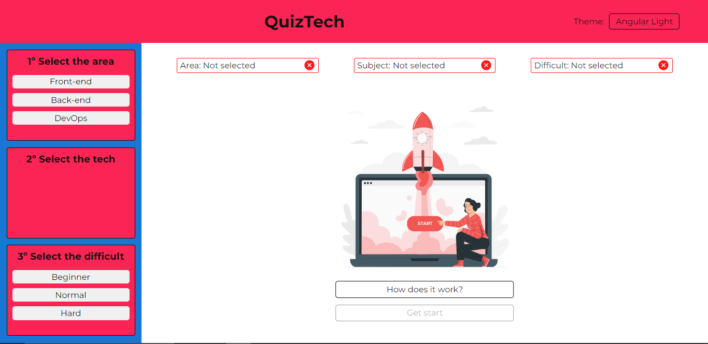

On the header, which has the theme switch button, as said previously, there are  6 kinds  of different themes.

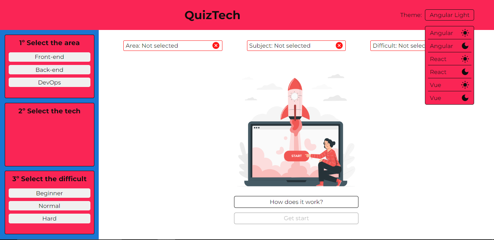

 <span> All the previous images is using the theme Angular Light which is the default theme when the application start. The images below will show the application using the other themes. </span>

<ul>
  <li>Angular Dark: 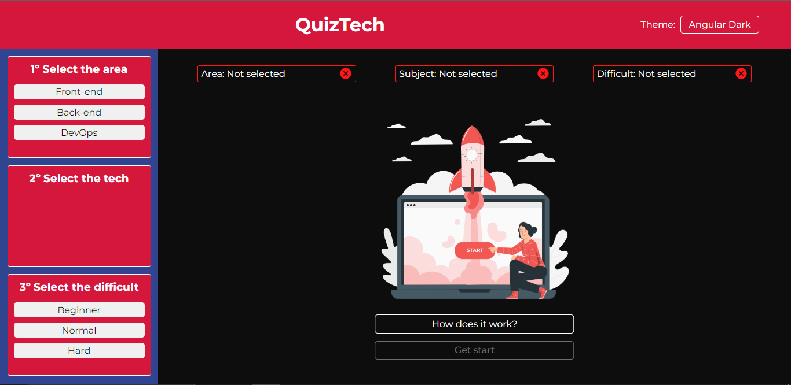</li>
  <li>React Light: 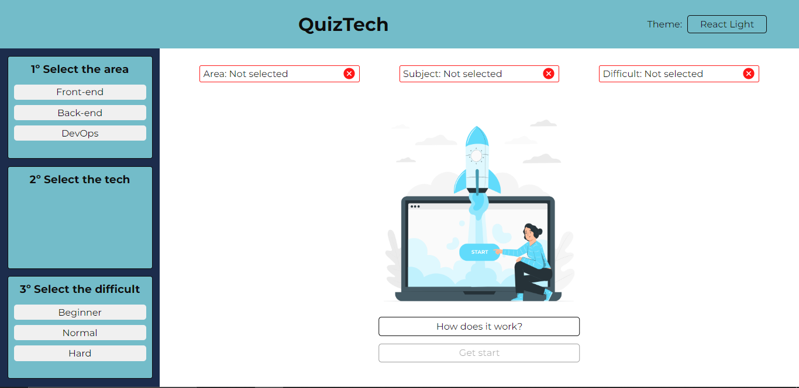</li>
  <li>React Dark: 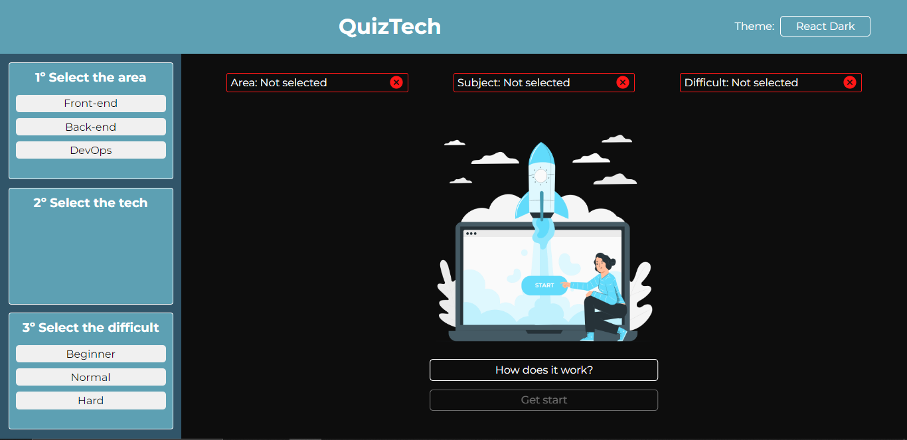</li>
  <li>Vue Light: 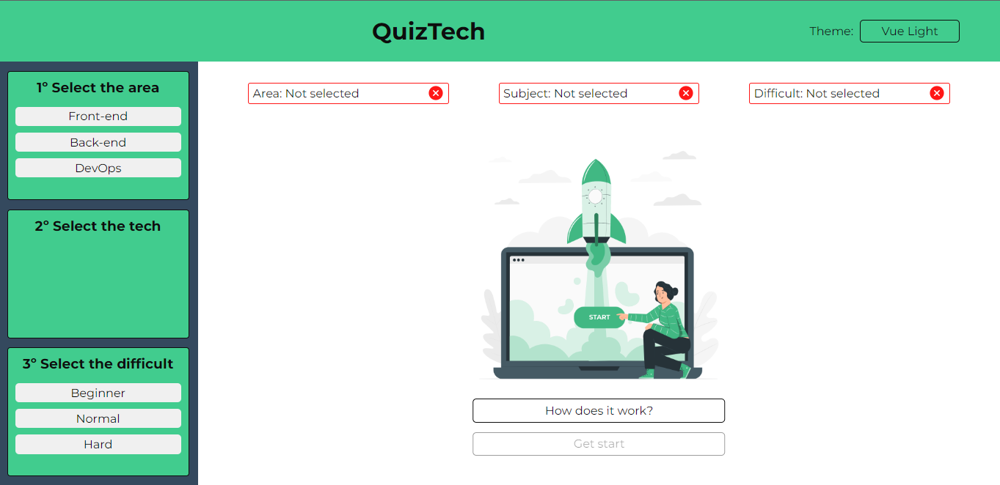</li>
  <li>Vue Dark: 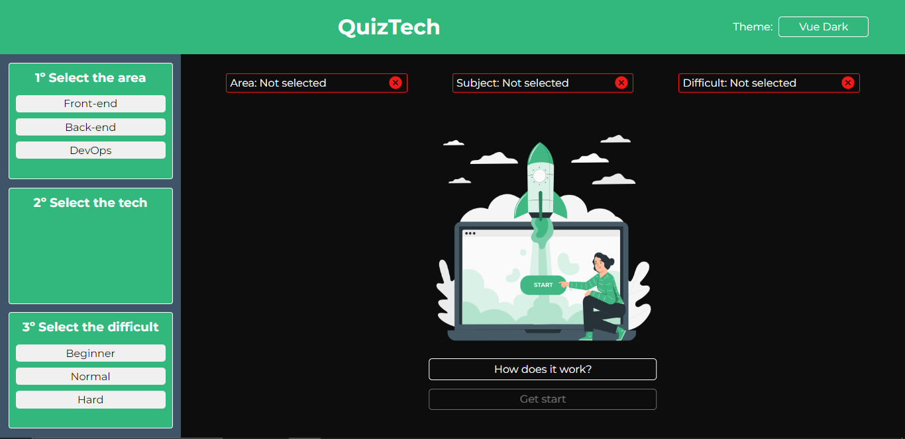</li>
</ul>

<span> In the sidenav, there are three sections: area, tech, and difficulty. The tech section has a different behavior; it will change according to the area selected at the moment. Here are some examples of the tech content changing dynamically.</span>
<ul>
  <li> Front-end selected: 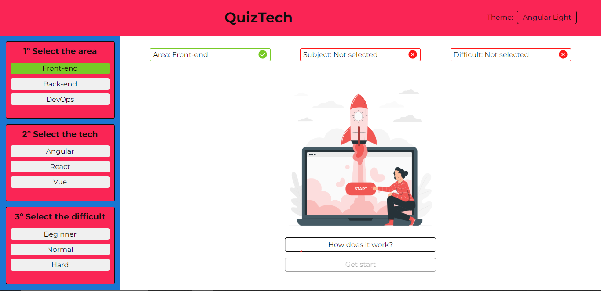 </li>
  <li> Back-end selected: 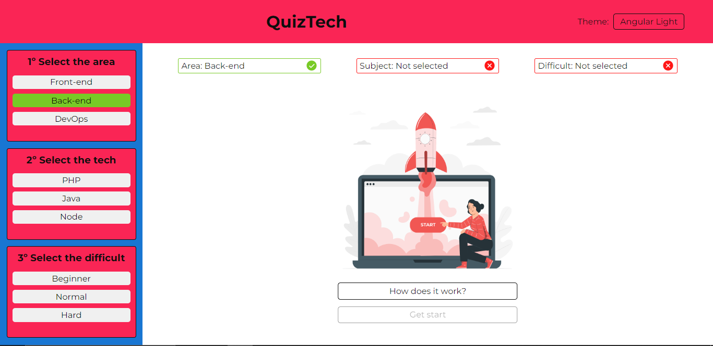</li>
  <li> DevOps selected: 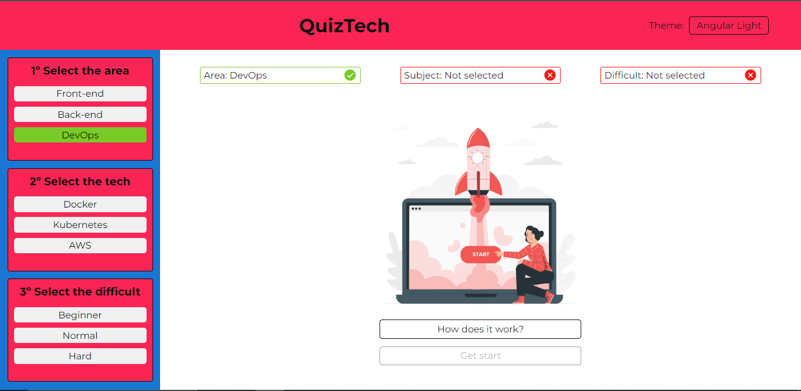 </li>
</ul> 

<span> If the user desire to know how the quiz works, there is a button "How does it work?" that shows the quiz flow.</span>

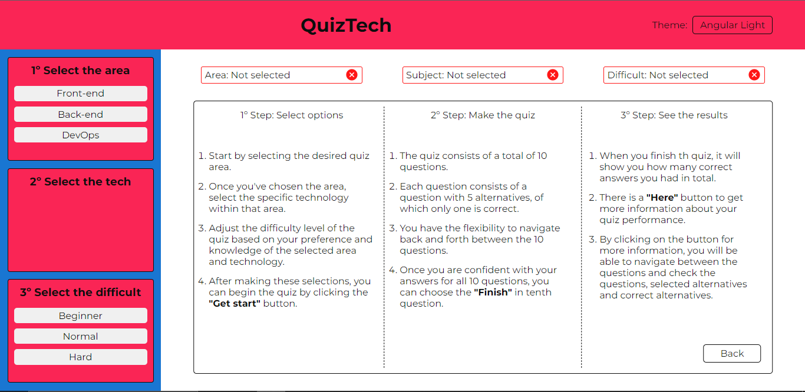 

<span>When the user selects the area, the tech and the difficult, the button to start the quiz will be allowed. </span>

 

<span> When the user starts the quiz, the sidenav becomes disabled, and in the center, the card of questions will be displayed, starting with the first question out of ten in total. Each question has 5 alternatives, with just one correct. The user can navigate through the questions with the buttons 'Prev' and 'Next.' The user can only move to the next question if there is an alternative selected, and can move to the previous question if applicable (the 'Prev' button is disabled for the first question).</span>

<span> The image below shows how looks like a question (the first one with the prev and next buttons disabled): </span>

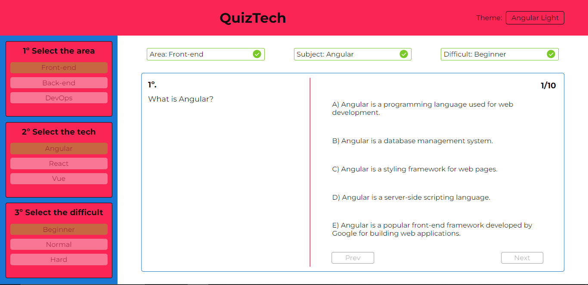 

<span> When the user finishes the quiz, it will display the user's performance (how many questions are correct out of the total), a button labeled 'here' to see more details about the questions (alternatives selected and correct alternatives for each and every single question), and two buttons: one labeled 'Try again' to restart the quiz with the same area, tech, and difficulty, but with questions and alternatives shuffled, and the other labeled 'Choose new options' to reset all user's choices (area, tech, and difficult). </span>

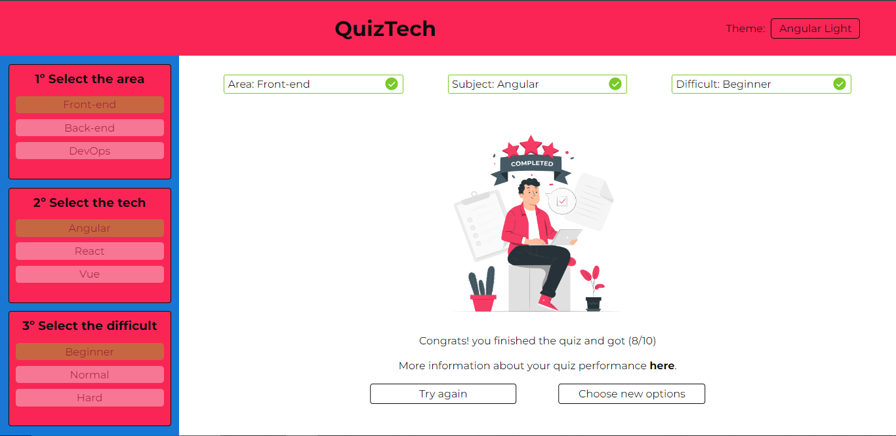 

<span> In case the user desires to know more details about the quiz performance, as said before, they need to click on the button 'here' which will display a card starting with the first question showing the text question, alternative selected by the user, and the correct alternative of the question. On the right side, there is a container with all the questions, and for each individual question, in the case the user selects the right alternative, it will have a green border; in the case they select the wrong alternative, it will have a red border. The user can navigate through the questions as they wish. <span>

 

<span>At the moment, the backend is creating questions for all areas and all techs, but just for beginner difficult. Soon, more questions are going to come!</span>


